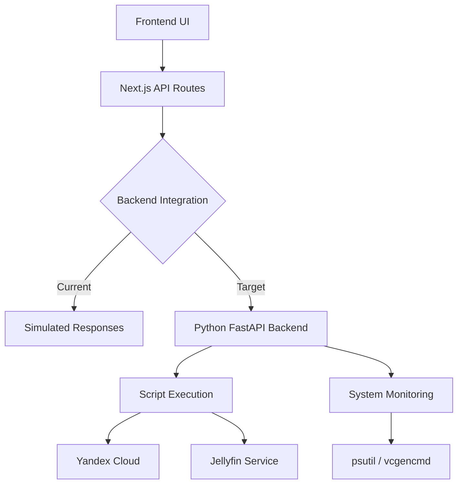

# Raspberry Pi Control Panel - Comprehensive Project Analysis

## Project Overview

**Project Name**: Raspberry Pi Control Panel  
**Purpose**: Local web-based dashboard for managing Raspberry Pi services and cloud resources  
**Architecture**: Full-stack application with Python backend (FastAPI) and Next.js frontend  
**Current State**: Development/Production hybrid with simulated frontend APIs and functional backend

## Project Structure

```
raspberry-pi-control-panel/
├── raspberry-pi-backend/          # Python FastAPI backend
│   ├── main.py                    # Main FastAPI application
│   ├── requirements.txt           # Python dependencies
│   ├── README.md                  # Backend documentation
│   └── scripts/                   # Management scripts
│       ├── yandex/                # Yandex Cloud scripts
│       │   ├── start_vps.py
│       │   └── check_status.py
│       └── jellyfin/              # Jellyfin media server scripts
│           ├── check_status.py
│           ├── get_logs.py
│           └── restart.py
├── app/                           # Next.js frontend
│   ├── api/                       # Frontend API routes (currently simulated)
│   │   ├── jellyfin/
│   │   ├── system/
│   │   └── yandex/
│   ├── components/                # React components
│   ├── lib/                       # TypeScript types and utilities
│   └── page.tsx                   # Main dashboard page
└── plans/                         # Analysis and planning documents
```

## Backend Architecture (Python FastAPI)

### Core Technologies
- **Framework**: FastAPI 0.109.0
- **ASGI Server**: Uvicorn 0.27.0
- **Data Validation**: Pydantic 2.5.3
- **System Monitoring**: psutil 5.9.8
- **Script Execution**: asyncio + subprocess

### Key Architectural Patterns
1. **API-First Design**: RESTful endpoints with automatic OpenAPI documentation
2. **Security-First Execution**: Whitelist-based script execution with path validation
3. **Modular Configuration**: Centralized config objects for scripts and disks
4. **Async Execution**: Non-blocking script execution with timeout management
5. **Health Monitoring**: Comprehensive system metrics collection

### Configuration Management
```python
SCRIPTS_CONFIG = {
    "yandex": {
        "start_vps": "/home/pi/scripts/yandex/start_vps.py",
        "status": "/home/pi/scripts/yandex/check_status.py",
    },
    "jellyfin": {
        "status": "/home/pi/scripts/jellyfin/check_status.py",
        "logs": "/home/pi/scripts/jellyfin/get_logs.py",
        "restart": "/home/pi/scripts/jellyfin/restart.py",
    },
}

DISK_CONFIG = {
    "allowed_mount_points": {"/", "/boot/firmware", "/mnt/SSD4TB/D"},
    "allowed_devices_pattern": r"mmcblk0p[12]|sd[a-z]+\d+",
    "labels": {
        "/": "Системный диск",
        "/boot/firmware": "Boot раздел",
        "/mnt/SSD4TB/D": "SSD 4TB Данные",
    },
}
```

## Frontend Architecture (Next.js)

### Core Technologies
- **Framework**: Next.js 16.2.4 with App Router
- **UI Library**: React 19
- **Styling**: Tailwind CSS 4.2.0 with shadcn/ui components
- **State Management**: SWR for data fetching
- **Type Safety**: TypeScript 5.7.3

### Key Architectural Patterns
1. **Component-Based UI**: Modular React components with clear separation of concerns
2. **Type-Safe API**: Comprehensive TypeScript interfaces for all data structures
3. **Responsive Design**: Mobile-first approach with Tailwind CSS
4. **Simulated Backend**: Current frontend APIs return mock data (awaiting backend integration)
5. **Command Pattern**: Config-driven command execution with status tracking

### Component Structure
- `CommandCard`: Reusable component for executing commands
- `SystemStatsCard`: Real-time system monitoring display
- `ThemeProvider`: Dark/light mode support
- 30+ shadcn/ui components for consistent UI

## API Endpoints & Data Flow

### Backend API (FastAPI - Port 8000)
```
POST   /api/yandex/start-vps     # Start Yandex Cloud VPS
POST   /api/yandex/status        # Check VPS status
POST   /api/jellyfin/status      # Check Jellyfin service status
POST   /api/jellyfin/logs        # Get Jellyfin logs
POST   /api/jellyfin/restart     # Restart Jellyfin service
GET    /api/system/status        # Get comprehensive system stats
GET    /api/health              # Health check endpoint
GET    /api/commands            # List available commands
GET    /api/disks/config        # Get disk configuration
```

### Frontend API (Next.js - Port 3000)
```
POST   /api/yandex/start-vps     # Currently simulated
POST   /api/yandex/status        # Currently simulated
POST   /api/jellyfin/status      # Currently simulated
POST   /api/jellyfin/logs        # Currently simulated
POST   /api/jellyfin/restart     # Currently simulated
GET    /api/system/status        # Currently simulated
```

### Data Flow Architecture


## Security Measures

### Backend Security
1. **Script Whitelisting**: Only executes scripts from `ALLOWED_COMMANDS` set
2. **Path Validation**: Verifies script existence before execution
3. **Timeout Protection**: 60-120 second timeouts for all script executions
4. **No Shell Injection**: Uses `subprocess` with parameter arrays, not shell strings
5. **CORS Configuration**: Currently permissive (`allow_origins=["*"]`) for development

### Frontend Security
1. **Type Safety**: Comprehensive TypeScript interfaces
2. **Input Validation**: Pydantic models for API responses
3. **Error Boundaries**: Graceful error handling in components

### Production Security Recommendations
1. **Network Isolation**: Restrict to local network (192.168.1.0/24)
2. **Authentication**: Add basic auth or token-based authentication
3. **HTTPS**: Implement TLS encryption
4. **CORS Restrictions**: Limit to frontend domain only
5. **Rate Limiting**: Add request throttling

## Business Logic Analysis

### Yandex Cloud Management
- **Script**: `start_vps.py`
- **Purpose**: Start Yandex Cloud VPS instance
- **Dependencies**: Yandex Cloud CLI (`yc`), environment variables
- **Logic Flow**:
  1. Check current instance status via `yc compute instance get`
  2. If not RUNNING, execute `yc compute instance start`
  3. Return status confirmation

### Jellyfin Media Server Management
- **Status Check**: `check_status.py`
  - Uses `systemctl is-active` to verify service status
  - Retrieves PID and memory usage via `systemctl show`
  - Provides web UI and API endpoints

- **Log Retrieval**: `get_logs.py`
  - Primary: `journalctl -u jellyfin -n 30`
  - Fallback: `/var/log/jellyfin/jellyfin.log`
  - 30-line limit with timeout protection

- **Service Restart**: `restart.py`
  - Four-step process: stop → clear cache → start → verify
  - Uses `sudo` for systemctl commands
  - Includes health check validation

### System Monitoring
- **CPU Metrics**: Temperature, voltage, frequency, usage
- **Memory Metrics**: RAM and swap usage
- **Disk Metrics**: Usage, health, filesystem type
- **Network Metrics**: Speed calculation with delta tracking
- **System Info**: Uptime, hostname, kernel version

## Deployment & Operations

### Backend Deployment
1. **Virtual Environment**: Python 3.x with `venv`
2. **Service Management**: Systemd unit file for auto-start
3. **Port Configuration**: Default port 8000
4. **Logging**: Journald integration via systemd
5. **Dependencies**: Managed via `requirements.txt`

### Frontend Deployment
1. **Build Process**: `next build` for production
2. **Static Export**: Optional static site generation
3. **Hosting**: Can be served from Raspberry Pi or separate server
4. **Environment**: Node.js with pnpm package manager

### Operational Considerations
1. **Resource Usage**: Lightweight (Python ~50MB RAM, Node.js ~100MB RAM)
2. **Network Access**: Backend must be accessible from frontend
3. **Script Permissions**: May require sudo configuration for service management
4. **Monitoring**: Built-in health checks and system metrics

## Current Integration Status

### ✅ Working Components
- Backend FastAPI server with full functionality
- Script execution engine with security controls
- System monitoring with comprehensive metrics
- Frontend UI with responsive design
- Type-safe data structures and components

### ⚠️ Integration Gaps
- Frontend APIs currently return simulated data
- No actual connection between frontend and backend APIs
- CORS configuration needs adjustment for production
- Environment variables for Yandex Cloud need proper setup

### 🔧 Required Integration Steps
1. Update frontend API routes to proxy to backend
2. Configure CORS to allow frontend-backend communication
3. Set up environment variables for Yandex Cloud credentials
4. Adjust script paths for production deployment
5. Implement proper error handling and logging

## Key Strengths

1. **Clean Architecture**: Clear separation between frontend and backend
2. **Security Conscious**: Whitelist-based execution model
3. **Comprehensive Monitoring**: Detailed system metrics collection
4. **Type Safety**: Full TypeScript coverage with Pydantic validation
5. **Extensible Design**: Easy to add new scripts and services
6. **Production Ready**: Includes systemd service and deployment docs

## Areas for Improvement

1. **Integration**: Connect frontend APIs to actual backend
2. **Authentication**: Add user authentication for production use
3. **Logging**: Enhance logging for debugging and auditing
4. **Configuration**: Externalize configuration from code
5. **Testing**: Add unit and integration tests
6. **Documentation**: Expand API documentation with examples

## Readiness Assessment

The project is **technically complete** but requires **integration work** to connect the frontend and backend. The backend is production-ready with proper security measures, while the frontend has a polished UI but currently uses simulated data.

**Immediate next steps**:
1. Modify frontend API routes to call backend endpoints
2. Configure CORS and network access
3. Deploy both services and test end-to-end functionality
4. Add authentication for production security

The codebase is well-structured, documented, and follows modern best practices for both Python and TypeScript development.